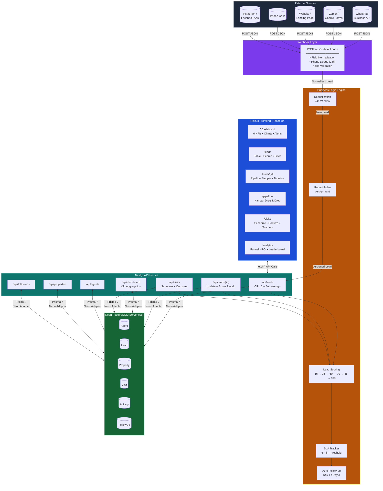
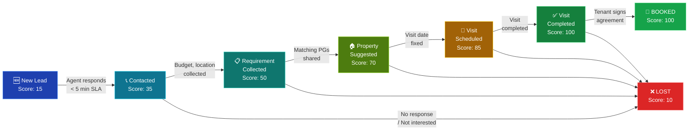
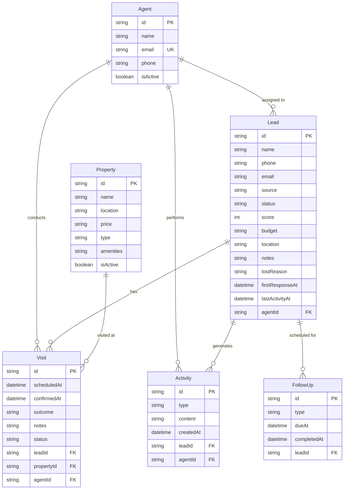
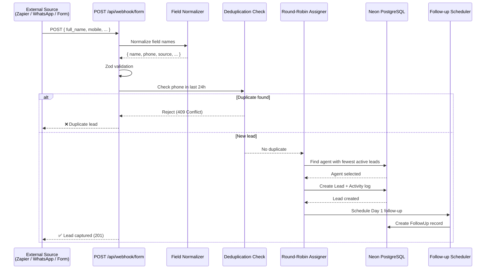

# Gharpayy CRM — Lead Management System for PG Accommodations

A full-stack CRM built to solve the chaotic, spreadsheet-driven lead management problem faced by PG accommodation providers in Bangalore. Built as an MVP that handles the entire lifecycle — from lead capture to booking — with automation, real-time analytics, and zero manual busywork.

**Live:** Deployed on Vercel | **Database:** Neon PostgreSQL (serverless)

---

## The Problem

PG accommodation providers in cities like Bangalore deal with hundreds of leads pouring in daily from WhatsApp, Instagram, phone calls, website forms, and Facebook ads. The typical workflow looks like this:

- **Leads get lost** — Inquiries come in on WhatsApp, get buried in chat, and nobody follows up
- **No tracking** — Operators have no idea which lead is at what stage, who's handling it, or when the last contact was
- **Manual everything** — Agents are assigned leads over phone calls, follow-ups are tracked in memory, and "analytics" means scrolling through spreadsheets
- **Slow response times** — Without SLA tracking, leads go cold within hours. The industry average first-response time is measured in days, not minutes
- **No visibility** — Owners can't see conversion rates, agent performance, or which marketing channels actually bring paying tenants
- **Revenue leaks** — Leads that showed interest but didn't book are never re-engaged. There's no system to nurture warm prospects

This isn't a hypothetical — it's the daily reality for thousands of PG operators managing 50-500+ beds across multiple properties.

---

## The Solution

Gharpayy CRM is a purpose-built Lead Management System that replaces the spreadsheet chaos with a structured, automated pipeline. Every lead gets captured, assigned, tracked, and followed up — automatically.

### Core Capabilities

| Capability | What It Does |
|---|---|
| **Omnichannel Lead Capture** | Webhook endpoint accepts leads from any source — Zapier, Tally, Google Forms, WhatsApp Business API, landing pages. Normalizes messy field names automatically. |
| **Smart Auto-Assignment** | Round-robin algorithm assigns leads to the agent with the fewest active leads. No manual intervention needed. |
| **8-Stage Pipeline** | Leads flow through: New → Contacted → Requirement Collected → Property Suggested → Visit Scheduled → Visit Completed → Booked → Lost |
| **Kanban Board** | Drag-and-drop pipeline visualization. Drag a lead card between columns to update its stage instantly (optimistic updates). |
| **Automated Lead Scoring** | Score updates automatically as leads progress: New (15) → Contacted (35) → Requirement (50) → Property (70) → Visit (85) → Booked (100) |
| **SLA Tracking** | 5-minute first-response threshold. Dashboard shows compliance %, breach count, and average response time. |
| **Auto Follow-ups** | Day 1 follow-up created on capture, Day 3 follow-up on stage transitions. Overdue follow-ups surfaced on the dashboard. |
| **Visit Management** | Schedule visits with property + agent + datetime, confirm visits, record outcomes (Booked / Considering / Not Interested). |
| **Real-time Dashboard** | 6 KPI cards, pipeline distribution chart, lead source breakdown, hot leads, needs-attention leads, agent performance grid. |
| **Analytics** | Conversion funnel with stage-by-stage drop-off %, lead source ROI comparison, agent leaderboard by conversion rate. |
| **24h Deduplication** | Webhook automatically detects duplicate leads (same phone number within 24 hours) and rejects them. |
| **Activity Timeline** | Every status change, note, call, and visit is logged with timestamps. Full audit trail per lead. |

---

## Tech Stack

| Layer | Technology | Why |
|---|---|---|
| **Framework** | Next.js 16 (App Router) | Full-stack React with API routes — no separate backend needed |
| **Language** | TypeScript | Type safety across the entire stack |
| **Database** | PostgreSQL via Neon | Serverless, scales to zero, free tier, works on Vercel |
| **ORM** | Prisma 7 | Type-safe database queries with driver adapters for Neon |
| **Styling** | Tailwind CSS 4 | Rapid UI development with consistent dark theme |
| **UI Primitives** | Radix UI | Accessible, unstyled dialog/select/dropdown/tooltip components |
| **Charts** | Recharts | Bar charts, pie charts, funnel charts for dashboards and analytics |
| **Drag & Drop** | @hello-pangea/dnd | Kanban board with native HTML5 drag-and-drop |
| **Validation** | Zod | Runtime validation for API inputs and webhook payloads |
| **Deployment** | Vercel | Zero-config deployment with automatic builds on git push |

---

## Architecture

### System Data Flow Diagram (DFD)



### Lead Lifecycle Flowchart



### Entity Relationship Diagram



### Webhook Data Flow



---

## Database Schema

6 models handling the complete lead lifecycle:

- **Agent** — Sales team members with round-robin load balancing
- **Lead** — Core entity with 20+ fields (contact, source, stage, score, budget, location, SLA timestamps)
- **Property** — PG listings with location, price, type, amenities
- **Visit** — Scheduled property visits linking Lead + Property + Agent
- **Activity** — Immutable audit log of every action (status change, note, call, visit)
- **FollowUp** — Scheduled follow-up tasks with completion tracking

---

## Challenges Faced & How They Were Solved

### 1. SQLite → PostgreSQL Migration (Vercel Deployment)
**Problem:** The initial build used SQLite with `better-sqlite3` for fast local development. When deploying to Vercel, the build failed — Vercel's serverless functions can't use file-based databases or native Node.js modules like `better-sqlite3`.

**Solution:** Migrated the entire database layer to Neon PostgreSQL with `@prisma/adapter-neon`. This required swapping the Prisma adapter, updating the schema provider, rewriting the database connection singleton, and re-seeding all demo data against a remote database.

### 2. Prisma 7 Driver Adapter Factory Pattern
**Problem:** Prisma 7 changed how driver adapters work. The old pattern of passing a `Pool` instance to `new PrismaNeon(pool)` was silently failing — the `PrismaNeon` export in v7 is actually a **factory class** that takes a config object and creates its own pool internally.

**Solution:** Discovered through systematic debugging (Pool worked directly, Prisma queries failed) that the correct pattern is `new PrismaNeon({ connectionString: url })`. Updated both `db.ts` and `seed.ts`.

### 3. Turbopack Compatibility with Native Modules
**Problem:** Next.js 16 defaults to Turbopack for development, but Turbopack crashes when the dependency tree includes native Node.js modules (`better-sqlite3` had `.node` binaries).

**Solution:** Used `next dev --webpack` flag during SQLite phase, then eliminated the problem entirely by switching to the Neon serverless driver (pure JavaScript, no native deps).

### 4. Webhook Field Normalization
**Problem:** External sources (Zapier, Tally, Google Forms, WhatsApp API) all send data with different field names — `full_name` vs `name` vs `Name`, `phone_number` vs `mobile` vs `Phone`, etc.

**Solution:** Built a normalization layer in the webhook endpoint that maps common field name variations to canonical fields, strips whitespace, normalizes phone numbers, and applies Zod validation — making the endpoint resilient to any form builder's naming conventions.

### 5. Optimistic UI for Kanban Pipeline
**Problem:** The Kanban board needs to feel instant when dragging leads between stages. Waiting for the API response before updating the UI creates visible lag.

**Solution:** Implemented optimistic updates — the UI state updates immediately on drop, the API call fires in the background, and the pipeline re-renders with server-confirmed data when the response arrives.

---

## What Makes This Work Exceptional

### Production-Grade Architecture, Not a Toy Demo
This isn't a CRUD tutorial with a form and a table. It's a **complete business system** with:
- 10 distinct pages, each solving a real workflow problem
- 9 API endpoints with proper validation, error handling, and business logic
- 6 database models with real relationships and constraints
- Automated scoring, assignment, deduplication, and follow-up scheduling

### Real Business Logic That Solves Real Problems
Every feature maps to a genuine pain point:
- **Round-robin assignment** eliminates the "Who's handling this lead?" confusion
- **SLA tracking** creates accountability — operators can see which agents respond slowly
- **Lead scoring** automatically prioritizes high-intent prospects
- **Deduplication** prevents the embarrassing double-contact problem
- **Activity timeline** creates a complete audit trail that protects both the operator and the agent

### Full-Stack Ownership
A single developer building and shipping:
- Database schema design
- Backend API with business logic
- Frontend UI with charts, drag-and-drop, and real-time updates
- Webhook integration for external systems
- Cloud database migration
- Production deployment

### Deployment-Ready From Day One
Not a localhost-only project. The CRM is:
- Deployed on Vercel with automatic CI/CD (push to GitHub → auto-deploy)
- Connected to a production Neon PostgreSQL database
- Accessible via a public URL with real data

---

## Getting Started

### Prerequisites
- Node.js 18+
- A Neon PostgreSQL database (free at [neon.tech](https://neon.tech))

### Setup

```bash
# Clone the repo
git clone https://github.com/raai2005/gharpayy.git
cd gharpayy

# Install dependencies
npm install

# Set up environment
cp .env.example .env
# Add your Neon DATABASE_URL to .env

# Generate Prisma client
npx prisma generate

# Push schema to database
npx prisma db push

# Seed demo data
npx tsx prisma/seed.ts

# Start development server
npm run dev
```

Open [http://localhost:3000](http://localhost:3000) to see the dashboard.

### Environment Variables

| Variable | Description |
|---|---|
| `DATABASE_URL` | Neon PostgreSQL connection string |

### Webhook Integration

Send leads from any external source via POST request:

```bash
curl -X POST https://your-domain.vercel.app/api/webhook/form \
  -H "Content-Type: application/json" \
  -d '{
    "name": "Priya Kumar",
    "phone": "+919876543210",
    "source": "whatsapp",
    "budget": "10000-15000",
    "location": "Koramangala"
  }'
```

The webhook accepts varied field names (`full_name`, `phone_number`, `mobile`, etc.) and normalizes them automatically.

---

## Project Structure

```
gharpayy-crm/
├── prisma/
│   ├── schema.prisma          # Database schema (6 models)
│   └── seed.ts                # Demo data seeder
├── src/
│   ├── app/
│   │   ├── page.tsx           # Dashboard
│   │   ├── leads/             # Lead management
│   │   ├── pipeline/          # Kanban board
│   │   ├── visits/            # Visit scheduling
│   │   ├── analytics/         # Funnel & leaderboard
│   │   ├── bookings/          # Booking tracker
│   │   ├── conversations/     # WhatsApp hub
│   │   ├── historical/        # CSV import
│   │   ├── settings/          # Config & webhook docs
│   │   └── api/               # 9 API routes
│   ├── components/            # Reusable UI components
│   └── lib/
│       ├── db.ts              # Prisma + Neon connection
│       └── utils.ts           # Utility functions
├── package.json
├── tailwind.config.ts
└── prisma.config.ts
```

---


Built by **Roy** — Full-stack development, database design, cloud deployment, and business logic engineering.
